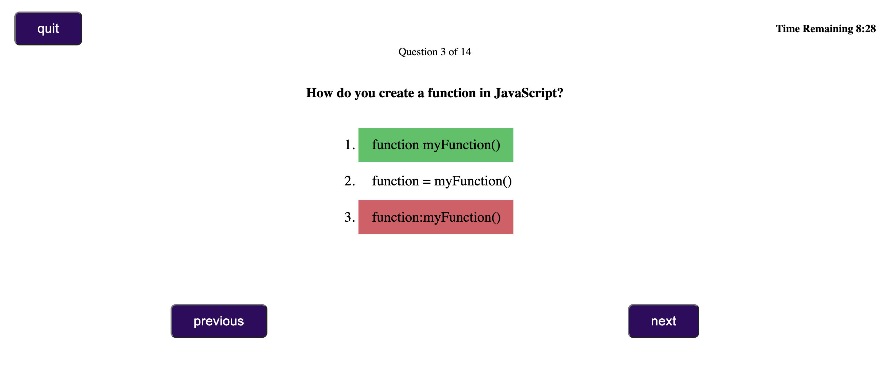

# Timed Quiz

This application shows a working timed quiz with sample set of JavaScript questions. You can try the application [here](https://anuvytla.github.io/timed-quiz/index.html).

In this application we explore the following key concepts to build timed quiz.
- show/hide different sections for html to mimic page navigation.
- setInterval and clearInterval for timer functionality.
- localStorage for storing quiz scores.
- Dynamically creating html elements and reusing container elements.